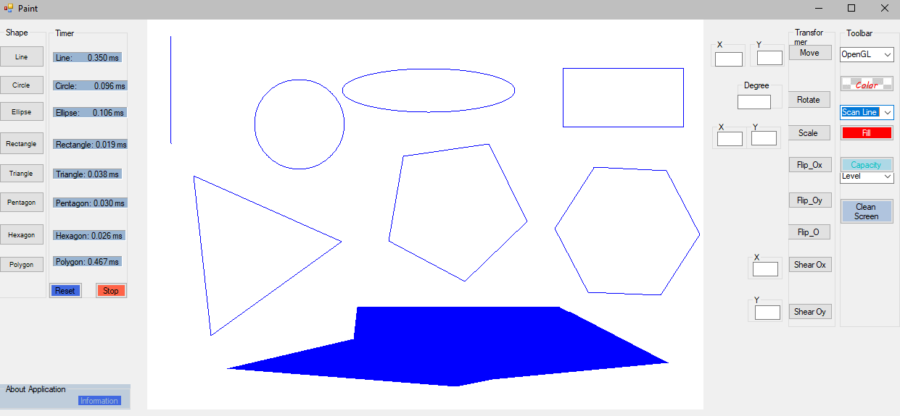

# Simple Paint

Simple Paint is a basic drawing application implemented in C# using SharpGL. It provides users with essential drawing functions such as lines, circles, and rectangles, inspired by Microsoft Windows Paint.

## Features

- Draw lines
- Draw circles
- Draw rectangles
- Draw Equilateral Triangle
- Draw Equilateral Pentagon
- Draw Equilateral Hexagon
- Draw Fill shapes
- Perform shape transformations:
  - Move
  - Rotate
  - Scale
  - Flip Ox
  - Flip Oy
  - Flip O
  - Shear Ox
  - Shear Oy

## Demo

## Installation

To use Simple Paint, follow these steps:

1. Clone this repository to your local machine.
2. Open the project in your preferred C# development environment.
3. Build and run the application.

## Usage

Once Simple Paint is running, you can:

- Select drawing tools from the toolbar.
- Click and drag on the canvas to draw shapes.
- Adjust properties such as color and line thickness.

## Contributing

Contributions are welcome! If you have any ideas for improvements or new features, feel free to open an issue or submit a pull request.

## Acknowledgements

- Inspiration from Microsoft Windows Paint
- Utilizes computer graphics algorithms
- Built with C# and SharpGL

## Contact

For questions or feedback, please contact [your email or username] or open an issue in the repository.
